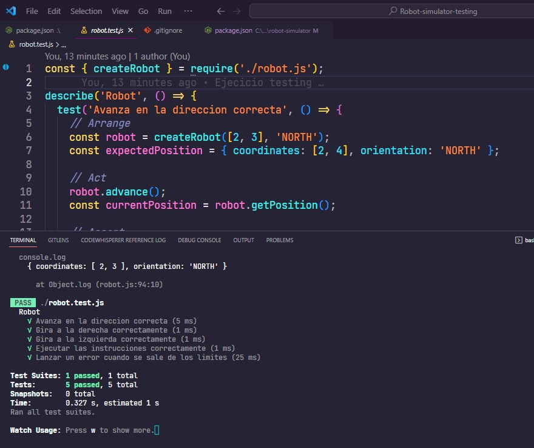
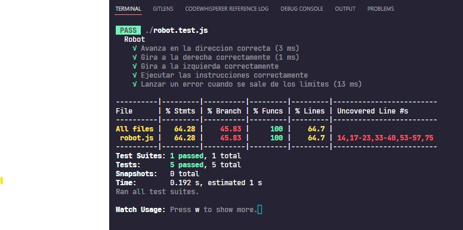

# Make It Real - Robot simulator testing

This is a solution to the Robot simulator testing project of the Make It Real course.

## Table of contents

- [Make It Real - Robot simulator testing](#make-it-real---robot-simulator-testing)
  - [Table of contents](#table-of-contents)
  - [Overview](#overview)
    - [The challenge](#the-challenge)
    - [Screenshot](#screenshot)
    - [Built with](#built-with)
    - [What I learned](#what-i-learned)
    - [Useful resources](#useful-resources)
  - [Acknowledgments](#acknowledgments)

## Overview

### The challenge

Users should be able to:

- Create an algorithm that simulates a robots behavior
- Make the corresponding test

### Screenshot

### Built with

- Jest
- Javascript

### What I learned
i learned how is sopposed to make tests with jest

### Useful resources

- [Jest](https://jestjs.io/) - reading the jest documentation

## Acknowledgments

Thanks to Our mentors of  makeitreal